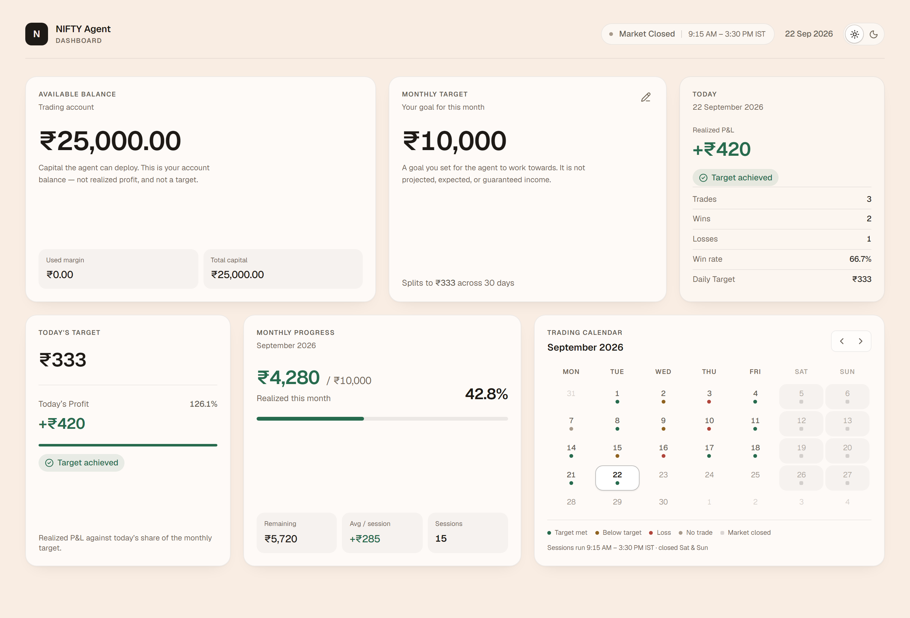
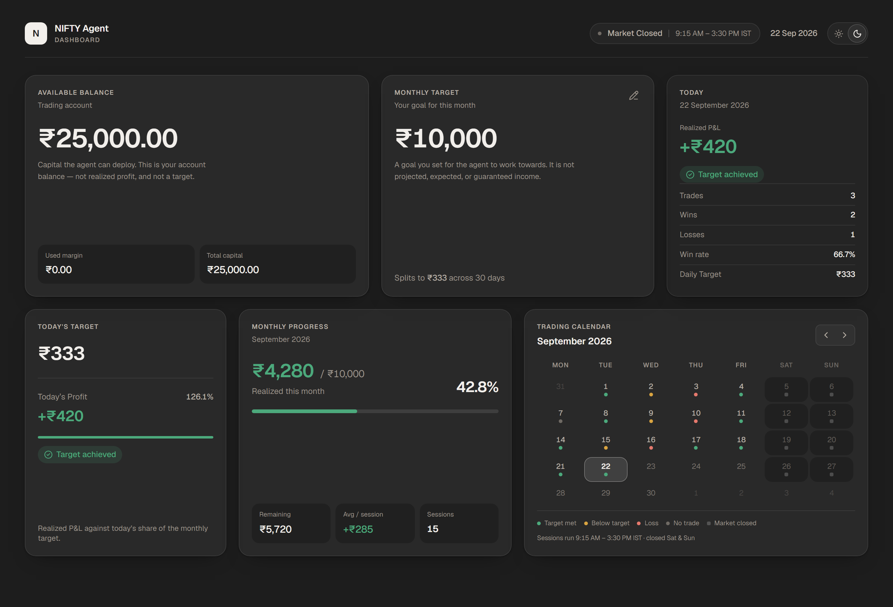
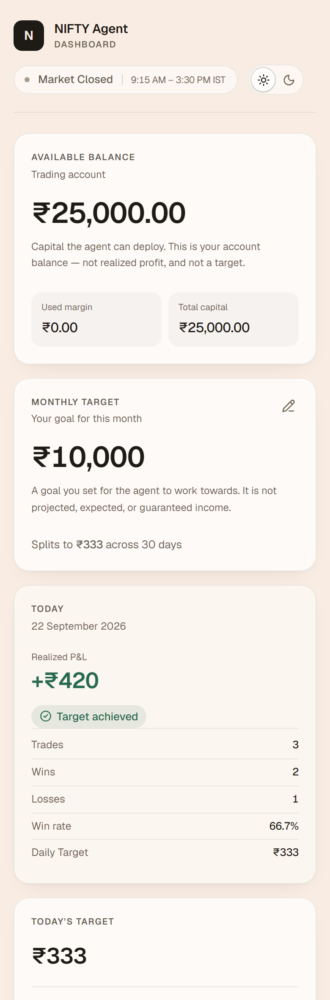

# NIFTY Agent — Dashboard

Monitoring dashboard for an autonomous NIFTY options trading agent.

The repository now contains **two applications**: a Next.js frontend
(`src/`) and a FastAPI backend (`backend/`). Every figure on screen is fetched
from the backend over HTTP — the frontend no longer reads a local mock module.

The backend now reads from PostgreSQL/TimescaleDB rather than from memory, so
the monthly target survives a restart. **The figures in that database are
still invented.** There is no broker connection, no live market data, no order
placement and no automatic trading. Persistence makes a number *durable*, not
*real* — so every response carries a `source` field (`database` or `mock`) and
every seeded row carries `source = 'development_seed'`.

| Phase       | Scope                                                       |
| ----------- | ----------------------------------------------------------- |
| **Phase 1** | Frontend, design system, bento layout, calendar — mock data  |
| **Phase 2** | FastAPI backend + full frontend integration — mock data      |
| **Phase 3** | Persistent data & time-series foundation — PostgreSQL/Timescale |

---

## The dashboard

**Light**



**Dark**



Both captures are the real production build at 1440×980. The screenshots are the
visual reference for this project: anything added later should match the density,
type scale, and restraint shown above.

---

## Design reference

The look is deliberately *institutional*, not *retail-trading*. If you are
extending the UI, these are the rules that produce it:

| Rule | Why |
| ---- | --- |
| One dominant figure per card, everything else subordinate | The eye should land on the number that matters, not scan six equal-weight stats |
| Micro-labels in uppercase 10.5px / `0.09em` tracking | Reads as a terminal field label; keeps titles from competing with figures |
| Inner metrics sit in *recessed* tiles, never raised ones | Elevation is reserved for the card itself, so depth stays meaningful |
| Colour is confirmation, never information | Every status carries an icon **and** a word; the hue only reinforces |
| Restrained green / red / amber, no neon, no gradients | Saturated colour on a financial figure reads as marketing, not data |
| Motion limited to 150–250ms entrances | Anything longer feels like a toy; anything bouncier feels like a game |
| `tabular-nums` on every figure | Digits must not shift column as values update |
| Generous whitespace over extra content | Empty space is what separates a dashboard from a spreadsheet |

The bento grid is the structural half of that: fixed rows of three, with a
deliberate size hierarchy rather than a uniform tile field.

**Responsive** — the same grid collapses to two columns at tablet width and one
at mobile, with no horizontal overflow at 360px.



---

## Layout

Desktop is a 12-column bento grid, two rows, max width 1440px:

```
┌──────────────────────┬────────────────┬───────────┐
│ Available Balance  5 │ Monthly Target │  Today  3 │   row 1
│                      │              4 │           │
├───────────┬──────────┴───┬────────────┴───────────┤
│ Today's 3 │ Monthly    4 │ Trading Calendar     5 │   row 2
│ Target    │ Progress     │                        │
└───────────┴──────────────┴────────────────────────┘
```

Today's Target, Monthly Progress and the Trading Calendar share **a single row**
on desktop. The 5-4-3 / 3-4-5 mirror keeps both rows on the same column rhythm
while giving the calendar a compact footprint.

| Breakpoint | Columns | Behaviour |
| ---------- | ------- | --------- |
| `< 768px`  | 1  | Full stack, calendar cells stay ≥36px tall |
| `768px+`   | 6  | Balance full width, then 2-up rows, calendar full width |
| `1024px+`  | 12 | The two-row bento above |

---

## Theming

The dashboard ships light and dark themes, toggled from the control in the top
right of the header.

| | Canvas | Primary card | Body text |
| ---- | ------ | ------------ | --------- |
| Light | `#F9EDE3` | `rgba(255,255,255,0.72)` | `#1E1A16` |
| Dark  | `#1D1D1D` | `rgba(255,255,255,0.055)` | `#F2EFEB` |

How it works:

- Every colour utility resolves to a runtime CSS variable through Tailwind's
  `@theme inline`. Flipping `.dark` on `<html>` re-themes the entire app without
  a single `dark:` variant in component code.
- A tiny script inlined in `<head>` (`THEME_INIT_SCRIPT`) resolves the stored or
  OS preference **before first paint**, so a dark-theme load never flashes light.
- The preference is read through `useSyncExternalStore`, which keeps hydration
  clean and syncs across tabs and live OS theme changes.
- Dark mode inverts the elevation model: inner metric tiles use a *darker*
  recess (`rgba(0,0,0,0.2)`) rather than a lighter tint, because a lighter tint
  drops the 10.5px tile labels below 4.5:1.

The toggle itself is a two-position segmented track rather than a single
morphing icon — the user can see both states and which one is active, so it
reads as an explicit setting instead of a mystery-meat button. The thumb is a
shared layout element, so selection glides between positions in one motion.

---

## Market sessions

NSE equity and F&O trade **9:15 AM – 3:30 PM IST, Monday to Friday**. The
session string appears in the header next to the market status, and again in the
calendar footer.

Saturdays and Sundays are rendered as non-trading days throughout:

- weekend columns are tinted and dimmed, and carry a square "market closed"
  marker rather than a round session dot
- weekend cells are plain `<div>`s, not buttons — they can never be selected
- screen readers get "Saturday, 5 September 2026. Market closed."
- selecting nothing on a weekend is impossible, but the summary card still has a
  weekend empty state for completeness

> **Production note:** exchange *holidays* are not derivable client-side. V1
> only knows the weekend rule. Once the backend exposes the holiday calendar,
> `isTradingDay()` in `src/lib/market.ts` should consult it too.

---

## Scope of this phase

**Implemented**

- Account balance summary (read-only), served by the backend — still mock,
  deliberately, because there is no broker to report funds
- User-defined monthly target with inline editing, **persisted in PostgreSQL**
  and unchanged by a restart, with every edit recorded in an audit table
- Automatically derived daily target (computed server-side, in `Decimal`)
- Today's progress against the daily target
- Month-to-date progress against the monthly target
- Custom September 2026 trading calendar with per-session markers
- Weekend / market-closed handling and NSE session hours
- Contextual summary for the selected date
- Light and dark themes with a persisted, no-flash toggle
- Responsive 12-column bento layout, 360px → 1920px

- Persistent PostgreSQL 16 + TimescaleDB schema, Alembic migrations, and a
  deterministic idempotent development seed
- Database health reporting, with a 503 — never a fabricated figure — when the
  data store is unreachable

**Deliberately not implemented** (out of scope for Phase 3)

Broker API integration (Angel One / Zerodha / Upstox / Dhan) · broker
authentication · live prices · option chains · WebSocket market feed · NSE
scraping · order placement or execution · automatic or paper trading · machine
learning, signals or strategy logic · API authentication ·
Redis / Kafka / Celery · Kubernetes · exchange holiday calendar.

The order, execution, trade, position, option-chain and journal tables **exist
and are empty**. They are the structural landing ground for later phases; a
seeded row in `orders` would be a claim that an order was placed, and none was.

> The monthly target is a **user-defined goal**, not projected or guaranteed
> income. The UI language is intentionally framed as *target* and *progress*.

---

## Stack

| Concern    | Choice                                   |
| ---------- | ---------------------------------------- |
| Framework  | Next.js 16 (App Router)                  |
| UI runtime | React 19                                 |
| Language   | TypeScript, `strict` + `noUncheckedIndexedAccess` |
| Styling    | Tailwind CSS 4 (`@theme inline` design tokens) |
| Icons      | Lucide React                             |
| Motion     | Motion (`motion/react`)                  |
| Dates      | date-fns                                 |
| Tooltips   | Radix UI (shadcn-style wrapper)          |

State is plain React state plus small hooks — no Redux, and no data-fetching
library: `src/lib/api/` is a thin typed wrapper over native `fetch`.
`localStorage` is now used for exactly one thing, the colour theme. The monthly
target moved to the backend in Phase 2, because two competing stores would
eventually disagree and the rounding rule belongs to the domain layer.

---

## Getting started

Three things: a database, the backend on port 8000, and the frontend on 3000.
Port 8000 is the only origin the frontend is configured to call, and port 3000
is the only origin the backend allows through CORS.

```bash
# the database — TimescaleDB on localhost:5432, data on a named volume
docker compose up -d

# terminal 1 — backend
cd backend
python -m venv .venv && .venv/Scripts/activate   # Linux/macOS: source .venv/bin/activate
pip install -e ".[dev]"
.venv/Scripts/python -m alembic upgrade head     # create the schema
.venv/Scripts/python -m app.db.seed              # optional demo data
uvicorn app.main:app --reload --port 8000        # http://localhost:8000/docs

# terminal 2 — frontend
npm install
cp .env.example .env.local
npm run dev                                      # http://localhost:3000
```

No database to hand? `REPOSITORY_BACKEND=mock` runs the API entirely in memory.
That is a configuration switch, not a fallback — nothing selects it
automatically, and a failed connection is reported as an error rather than
quietly serving invented figures.

| Script              | Purpose                        |
| ------------------- | ------------------------------ |
| `npm run dev`       | Development server             |
| `npm run build`     | Production build               |
| `npm run start`     | Serve the production build     |
| `npm run lint`      | ESLint                         |
| `npm run typecheck` | `tsc --noEmit`                 |

---

## Project structure

```
src/
  app/
    layout.tsx              Root layout, fonts, metadata, pre-paint theme script
    page.tsx                Server entry → <Dashboard />
    globals.css             Light/dark tokens (@theme inline) + base styles
  components/
    dashboard/
      Dashboard.tsx         Client orchestrator; owns interactive state
      DashboardHeader.tsx   Identity, market status + hours, date, theme toggle
      AccountBalanceCard.tsx
      MonthlyTargetCard.tsx
      DailyTargetCard.tsx
      MonthlyProgressCard.tsx
      TradingCalendar.tsx
      TradingSummaryCard.tsx
    ui/
      BentoCard.tsx         Card shell + header
      CurrencyValue.tsx     INR figure with tabular numerals
      ProgressBar.tsx       Clamped, accessible progress indicator
      StatusIndicator.tsx   Status → icon + label + tone mapping
      StatRow.tsx
      ThemeToggle.tsx       Segmented light/dark control
      Tooltip.tsx
    ui/
      CardState.tsx         Shared loading skeleton + error/offline state
  hooks/
    useApiResource.ts       Generic fetch-with-state hook (loading/ready/error)
    useMonthlyTarget.ts     Backend-backed target: read, save, revision counter
    useTheme.ts             Persisted theme via useSyncExternalStore
  lib/
    api/
      client.ts             The only place that speaks HTTP; ApiError, timeouts
      types.ts              Wire shapes + snake_case → camelCase transforms
      account.ts            GET /account/summary
      targets.ts            GET | PUT /targets/monthly
      performance.ts        GET /performance/{today,monthly,calendar,:date}
      agent.ts              GET /agent/status
    currency.ts             INR formatting + input parsing
    targetCalculations.ts   Target maths and status derivation
    dates.ts                Calendar grid + date formatting
    market.ts               NSE session hours + trading-day rules
    theme.ts                Theme constants + pre-paint init script
    utils.ts                cn()
  data/
    mockTradingData.ts      Single source of mock data
  types/
    trading.ts              Domain types
docs/
  dashboard-*.png           Reference screenshots used in this README
```

---

## Core logic

**Daily target** — computed **once, in the backend**, using `Decimal` with an
explicit `ROUND_HALF_UP`. The frontend displays the returned value and never
recomputes it, so there is exactly one implementation of the rule:

```python
daily_target = (monthly_target / 30).quantize(Decimal(1), ROUND_HALF_UP)
```

Fractions below `.5` round down, `.5` and above round up:

| Monthly   | Daily  |
| --------- | ------ |
| ₹10,000   | ₹333   |
| ₹10,010   | ₹334   |
| ₹15,000   | ₹500   |
| ₹20,000   | ₹667   |

> **Production note:** the fixed 30-day denominator is a simplification, which
> is why the response reports `"calculation_mode": "calendar_days_30"`. It
> should become the number of remaining NSE trading sessions, which requires an
> exchange holiday calendar. Only the domain calculation changes; the wire
> contract already carries the mode so clients can tell the two apart.

**Session status** — derived, never stored, so the cards and the calendar can
never disagree:

| Condition                           | Status        |
| ----------------------------------- | ------------- |
| `profit === 0`                      | `not-started` |
| `profit < 0`                        | `loss`        |
| `0 < profit < dailyTarget`          | `in-progress` |
| `profit >= dailyTarget`             | `achieved`    |

Progress bars clamp at 100% while the displayed percentage is free to exceed it.

---

## Backend

A typed, asynchronous FastAPI service. It owns every number the dashboard
displays, including the notion of "today" — so the calendar, the summary card
and the daily target can never disagree about which session is current.

### Architecture

```
HTTP  →  API route        thin; parses and serialises, no business logic
      →  Service          orchestration and domain rules
      →  Repository       a typing.Protocol — the seam a broker slots into
      →  PostgreSQL       SQLAlchemy 2.x async + asyncpg   (default)
         or Mock          deterministic in-memory data     (REPOSITORY_BACKEND=mock)
```

Domain models (`app/domain/`) are kept separate from API schemas
(`app/schemas/`) so the wire format can change without disturbing the maths,
and vice versa. Dependencies are injected with FastAPI's `Depends`; there is no
global mutable state, and the repository singletons are `lru_cache`d with an
explicit `reset_repositories()` used by the test fixtures.

```
backend/
  app/
    main.py               create_app(): lifespan, CORS, middleware, handlers
    dependencies.py       DI wiring; backend selection, per-request session
    api/v1/               health, account, targets, performance, agent routes
    services/             target, account, performance, agent services
    domain/               enums, models, clock, Decimal calculations
    schemas/              Pydantic v2 request/response models
    repositories/         Protocol interfaces + postgres/ + mock/
    db/                   engine & session, models/, health probe, seed
    core/                 settings, logging, exceptions, constants, time
  alembic/                migration environment + versions/
  tests/                  unit (no database) + integration/ (real database)
  pyproject.toml          deps + ruff/mypy/pytest config — no setup.py
```

### Tech

Python 3.12 · FastAPI · Uvicorn · Pydantic v2 · pydantic-settings ·
SQLAlchemy 2.x (asyncio) · asyncpg · Alembic · PostgreSQL 16 + TimescaleDB ·
httpx · pytest + pytest-asyncio · Ruff · mypy (`strict`). Times are
timezone-aware and centralised on `Asia/Kolkata` via `zoneinfo`; money is
`Decimal` in Python and `NUMERIC` in the database, never `float`.

All database access is asynchronous. There is no synchronous session and no
legacy `session.query(...)` anywhere in the codebase.

### Endpoints

All under `/api/v1`. JSON is `snake_case`; money is `Decimal` internally and a
plain JSON number on the wire.

| Method | Path                       | Purpose                                 |
| ------ | -------------------------- | --------------------------------------- |
| GET    | `/health`                  | Service status + database state          |
| GET    | `/health/live`             | Process only — never touches the database |
| GET    | `/health/ready`            | Readiness, including the database        |
| GET    | `/account/summary`         | Available balance, used margin, capital |
| GET    | `/targets/monthly`         | Monthly target + derived daily target   |
| PUT    | `/targets/monthly`         | Set the monthly target                  |
| GET    | `/performance/today`       | The current session                     |
| GET    | `/performance/monthly`     | Month-to-date totals                    |
| GET    | `/performance/calendar`    | One month of sessions (`?year=&month=`) |
| GET    | `/performance/{date}`      | A specific session                      |
| GET    | `/agent/status`            | Agent state — only `DISABLED` operative |

Interactive docs: `/docs` (Swagger), `/redoc`, `/openapi.json`.

**There are deliberately no `/buy`, `/sell`, `/trade`, `/execute`, `/order` or
`/exit-all` endpoints, and no `/predict`, `/ai-signal` or `/next-trade`.** The
service cannot place an order or fabricate a prediction, because the routes to
do so do not exist.

### Environment

Configuration is `pydantic-settings`; copy `backend/.env.example` to
`backend/.env`. Real `.env` files are gitignored and must never be committed.

| Variable              | Default                 | Notes                                |
| --------------------- | ----------------------- | ------------------------------------ |
| `ENVIRONMENT`         | `development`           | Hides docs when `production`         |
| `CORS_ORIGINS`        | `http://localhost:3000` | Explicit list; never `*`             |
| `LOG_LEVEL`           | `INFO`                  | Structured logs with request IDs     |
| `REPOSITORY_BACKEND`  | `postgres`              | `mock` runs with no database         |
| `POSTGRES_HOST/PORT`  | `localhost` / `5432`    |                                      |
| `POSTGRES_DB/USER`    | `trading_agent`         |                                      |
| `POSTGRES_PASSWORD`   | dev default             | `SecretStr`; masked when printed     |
| `DB_HEALTH_TIMEOUT`   | `5.0`                   | Ceiling on the health `SELECT 1`     |

The connection URL is assembled from these parts rather than read as a single
DSN, because a URL in an environment variable is the classic way a password
ends up in a shell history, a log line or a crash report.

CORS is scoped to one explicit origin and to `GET, PUT, OPTIONS` only. Every
response carries an `X-Request-ID`; logs include it for correlation and never
contain secrets, auth headers or cookies.

### Errors

A single envelope, with no stack traces, file paths or internals leaked:

```json
{ "error": { "code": "VALIDATION_ERROR", "message": "monthly_target: Input should be greater than 0" } }
```

A database failure is a **503**, not a 500, with a fixed message that carries
no host, port, username or driver text:

```json
{ "error": { "code": "DATABASE_UNAVAILABLE", "message": "The service is temporarily unable to reach its data store. No data has been changed. Please retry shortly." } }
```

503 says "this request would have worked, try again", which is true and is what
a load balancer and a retry policy key on. **There is no fallback to mock
figures** — a dashboard showing an invented ₹4,690 because the database was
unreachable is worse than one showing an error, because the user would act on a
number that describes nothing.

### Testing

```bash
cd backend
.venv/Scripts/python -m pytest                     # 153 tests
.venv/Scripts/python -m pytest tests/integration   # database only
.venv/Scripts/python -m ruff check .
.venv/Scripts/python -m mypy app tests             # strict, 78 files
```

API tests run in-process through `httpx.ASGITransport` — no socket, no port.
Integration tests build a throwaway `trading_agent_test` database by running
the real migrations, and skip with a reason when no database is reachable
rather than failing. They never touch the development database.

### Limitations

The 30-day denominator for the daily target is a simplification; the real
figure is remaining NSE trading sessions, which needs an exchange holiday
calendar. Account balance is still mock, deliberately — there is no broker to
report funds, and persisting an invented balance would make it look settled.
There is no authentication and no rate limiting.

### Roadmap — the trading pipeline

Documented, **not implemented**. The intended order, once a broker adapter
exists:

```
Model  →  Signal  →  Options Selector  →  Risk Engine  →  Execution Validation  →  Broker Adapter
```

The **Risk Engine holds veto authority**: it sits before execution validation
and can reject any proposed trade regardless of model confidence. No signal may
reach a broker adapter without passing it.

---

## Phase 3 — Data Foundation

Volatile development storage replaced with a persistent, professional data
layer. Full schema reference, rationale and operational notes:
**[`docs/database.md`](docs/database.md)**.

### What it adds

- **PostgreSQL 16 + TimescaleDB** via Docker Compose, with a healthcheck and a
  named volume (`nifty_agent_postgres_data`) that outlives the container
- **15 tables** — the application half in use today, the trading half defined
  and deliberately empty
- **Three hypertables** — `ohlcv_candles` (7-day chunks), `option_quotes`
  (1-day), `india_vix` (30-day), sized by expected write volume
- **Alembic migrations**, async, with the URL taken from settings so no
  password is ever written to a committed file
- **`python -m app.db.seed`** — deterministic, idempotent, non-destructive
- **Liveness / readiness split** and a 503 contract for database failure

### The decisions worth knowing

| Decision | Reason |
| --- | --- |
| Money is `NUMERIC(20,4)` / `Decimal` | Binary floating point cannot represent `0.10`. A paisa of drift per operation compounds silently. |
| UUID primary keys | Rows can be built before insert and merged from several producers. The seed derives UUIDv5 keys from natural keys, so a re-run reproduces the same identifiers. |
| `VARCHAR` + `CHECK`, not native enums | Adding a value to a PostgreSQL enum is an awkward, hard-to-reverse migration; an unconstrained `VARCHAR` lets `"BUYY"` through. A `CHECK` derived from the `StrEnum` gives the guarantee with a one-line swap. |
| Every FK is `ON DELETE RESTRICT` | Deleting an instrument must not silently take months of candles with it. There is no `DELETE` endpoint and no `POST /reset-database`. |
| `daily_target` stored per row | It records the goal actually in force that day. Deriving it from today's target would rewrite history on every edit, making a missed day look achieved. |
| Absence ≠ zero | A date with no row means *no trading*; that is a different fact from *traded and broke even*, and merging them corrupts the win-rate denominator. |
| Engine opened lazily | An unreachable database becomes failing requests with a real error and a healthy `/health/live`, not a process that refuses to boot. |

### Provenance

Two independent labels, answering different questions:

| Where | Values | Means |
| --- | --- | --- |
| API envelope `source` | `database`, `mock` | Where the **service** read the figure from |
| Row column `source` | `development_seed`, later `nse` | Where the **data** came from |

So a seeded P&L arrives as `source: database` in the envelope while the row
itself still says `development_seed` — invented data stays traceable even
after it is persisted. The account endpoint reports `source: mock` **even with
a database present**, because there is no broker and therefore no real balance.

---

## Accessibility

- Semantic landmarks, real `<button>` elements, `aria-label` on icon-only
  controls, visible focus rings
- A `<table>`-based calendar with weekday column headers and per-cell labels
  that read the date, status and signed P&L
- Status is conveyed by icon **and** text as well as colour
- Every text tone was measured against every surface it can land on — card,
  muted card, recessed tile, bare canvas — and clears **WCAG AA (4.5:1) in both
  themes**. Worst case is 4.64:1 (light) and 4.78:1 (dark).
- Motion is limited to ~150–250ms entrances and respects
  `prefers-reduced-motion`

---

## Verified

**Backend** — 153 tests pass (unit + integration against a real TimescaleDB),
`ruff check` and `ruff format --check` clean, `mypy --strict` clean across 78
files. Verified against a live Uvicorn server, not only the test suite: OpenAPI
schema, `PUT 15000 → 500`, `20000 → 667`, `10010 → 334`, `-5000 → 422` with the
error envelope and no traceback, and a 404 probe confirming the order and
prediction routes genuinely do not exist.

**Database**, verified against the running stack rather than assumed:

- **Durability** — `docker compose down` (which removes the container
  entirely) then `up -d`: the monthly target, all 17 seeded sessions and the
  Timescale chunk layout (`india_vix` 2 chunks, `ohlcv_candles` 4) were intact
  afterwards, on the named volume
- **Restart survival (§60)** — ₹15,000 set through the API yields ₹500/day, and
  a **separate Python process** reads back ₹15,000 unchanged
- **Determinism** — identical business-column checksums across a full wipe and
  reseed; re-running the seed leaves every row and the audit log untouched, and
  does not overwrite a manually edited target
- **Migrations** — every integration run drops the test database and rebuilds
  it from `alembic upgrade head`, so a broken migration fails the suite.
  `downgrade base` → `upgrade head` round-trips cleanly, and `alembic check`
  reports *no new upgrade operations*, so the models and the migration have not
  drifted apart
- **Database down** — liveness stays `200 alive`; `/health` and `/health/ready`
  return 503 `degraded`; data endpoints return 503 `DATABASE_UNAVAILABLE`; the
  account endpoint still returns `200` with `source: mock`; and no response
  body contains a host, port, username, driver name or traceback
- **Recovery** — three consecutive successes in the same process on the same
  pool after the container came back; `pool_pre_ping=True` heals it without a
  restart

The database-down path was found by actually stopping the container: a refused
TCP connection arrives as a bare `ConnectionRefusedError` from the event loop's
socket layer, which the original `SQLAlchemyError` handler never saw, and it
escaped as a 500 with a traceback. Both shapes are now handled and tested.

**Frontend** — `npm run lint`, `npx tsc --noEmit` and `npm run build` all pass
clean, with **zero console warnings, errors or exceptions** in the browser
(including no React hydration mismatches — no `new Date()` is evaluated during
render; the trading date comes from the backend).

**Integration**, checked in a real browser against the running API:

- All six cards render live backend data on load
- Editing the monthly target to ₹30,000 recalculates the whole dashboard:
  daily target → ₹1,000, today's +₹420 flips from *Target achieved* to
  *Below target* with ₹580 remaining, monthly progress → 14.3%, and the
  calendar re-colours every session against the new target
- With the backend stopped, all six cards show *unavailable* with offline copy
  and a Retry button — **never a stale or default figure**, never `NaN` or
  `undefined` — and Retry recovers every card in place once it is back up

Checked in both themes: layout at 360 / 768 / 1024 / 1280 / 1440px with no
horizontal overflow, INR formatting, calendar accuracy against the real 2026
calendar, weekend non-interactivity, theme persistence across reload and over
the OS preference, and edge cases (zero / negative / non-numeric / oversized).
