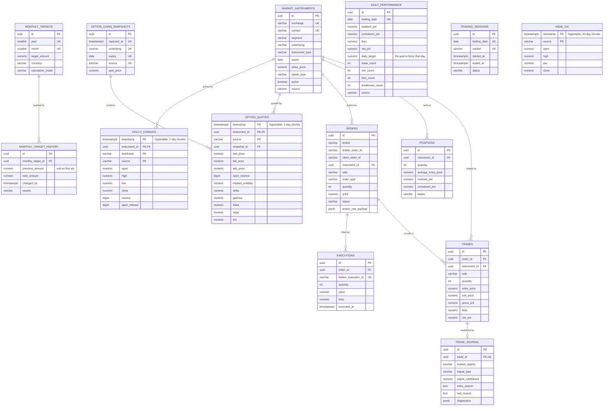

# Database — schema, decisions and operations

PostgreSQL 16 with the TimescaleDB extension. This document explains what the
schema stores, why it is shaped the way it is, and how to run it.

> **The data currently in this database is invented.** No broker is connected
> and no market feed is subscribed. Every row written by the seed carries
> `source = 'development_seed'`, and every API response carries a `source`
> field. Nothing in Phase 3 makes a number real — persistence only makes it
> *durable*, and a durable fiction is still a fiction.

---

## Contents

- [Running it](#running-it)
- [Entity relationships](#entity-relationships)
- [The two halves of the schema](#the-two-halves-of-the-schema)
- [Tables](#tables)
- [Design decisions](#design-decisions)
- [Migrations](#migrations)
- [Seeding](#seeding)
- [Health and failure behaviour](#health-and-failure-behaviour)
- [Testing](#testing)
- [Operational notes](#operational-notes)

---

## Running it

```bash
docker compose up -d                       # TimescaleDB on localhost:5432
cd backend
.venv/Scripts/python -m alembic upgrade head
.venv/Scripts/python -m app.db.seed        # optional, development only
```

Connection settings come from the environment, never from a committed file:

| Variable            | Default                  | Notes                                     |
| ------------------- | ------------------------ | ----------------------------------------- |
| `POSTGRES_HOST`     | `localhost`              |                                           |
| `POSTGRES_PORT`     | `5432`                   |                                           |
| `POSTGRES_DB`       | `trading_agent`          |                                           |
| `POSTGRES_USER`     | `trading_agent`          |                                           |
| `POSTGRES_PASSWORD` | dev default              | `SecretStr`; masked wherever it is printed |
| `REPOSITORY_BACKEND`| `postgres`               | `mock` runs the API with no database       |
| `DB_POOL_SIZE`      | `5`                      | plus `DB_MAX_OVERFLOW=5`                   |
| `DB_HEALTH_TIMEOUT` | `5.0`                    | ceiling on the health probe's `SELECT 1`   |

The URL is **assembled from parts** rather than read as a single DSN. A URL in
an environment variable is the classic way a password ends up in a shell
history, a log line or a crash report.

`REPOSITORY_BACKEND=mock` is a configuration switch, **not a fallback**.
Nothing catches a connection error and quietly serves mock figures instead —
see [Health and failure behaviour](#health-and-failure-behaviour).

---

## Entity relationships



---

## The two halves of the schema

**In use today** — written and read by the running application:

`monthly_targets` · `monthly_target_history` · `daily_performance` ·
`trading_sessions` · `market_instruments` · `ohlcv_candles` · `india_vix`

**Defined but empty** — the structural landing ground for later phases:

`orders` · `executions` · `trades` · `positions` · `option_chain_snapshots` ·
`option_quotes` · `trade_journal`

Why define them now rather than when they are needed? Because adding an order
table to a system that already has months of P&L history means backfilling
relationships that were never recorded. The tables cost nothing empty, and
their presence forces the foreign-key shape to be thought through once,
while it is cheap to change.

Why they are **empty and not seeded**: an `orders` row is a claim that an
order was placed. There is no broker, so there was no order, and inventing one
would put a fabricated execution record in the same table a real one will
later occupy — with no way for a future reader to tell them apart.

---

## Tables

### `monthly_targets`

The user's stated goal for a calendar month, and the reason Phase 3 exists.
One row per `(year, month)`, enforced by a unique constraint.

`calculation_mode` records *how* the daily figure was derived —
`calendar_days_30` today. Storing it means a later switch to "remaining NSE
sessions" does not silently reinterpret historical targets.

### `monthly_target_history`

Append-only audit of every change. `previous_amount` is `NULL` for the first
value, because there was nothing before it.

A no-op edit writes nothing. Saving ₹15,000 over ₹15,000 is not a change, and
an audit log full of "₹15,000 became ₹15,000" is one nobody reads when it
matters.

### `daily_performance`

One row per trading date — the journal the dashboard renders.

`daily_target` is stored per row rather than derived on read. That looks like
denormalisation and is deliberate: it records the goal that was actually in
force on that date. Deriving it from today's monthly target would silently
rewrite history every time the user changed their goal, making a day that was
missed look achieved.

Counts are constrained so outcomes cannot outnumber attempts
(`win + loss + breakeven <= trade_count`), which catches a whole class of
aggregation bug at write time rather than on a dashboard.

Absence is meaningful: a date with no row means *no trading*, which is a
different fact from *traded and broke even*. Collapsing the two would corrupt
the win-rate denominator.

### `market_instruments`

The tradable-symbol registry, keyed `(exchange, symbol)`. Everything that
refers to an instrument does so by UUID, so a symbol rename does not orphan
history.

### `ohlcv_candles`, `india_vix`, `option_quotes`

Hypertables. Composite primary keys lead with `timestamp`, which is a hard
TimescaleDB requirement rather than a style choice — a unique index on a
hypertable must contain the partitioning column, because uniqueness is only
enforced within a chunk.

`source` is part of the primary key. Two providers quoting the same instrument
at the same instant is normal, and they must not silently overwrite each other.

| Table            | Chunk interval | Reasoning                                                     |
| ---------------- | -------------- | ------------------------------------------------------------- |
| `option_quotes`  | 1 day          | Heaviest write path — a full chain, repeatedly, intraday       |
| `ohlcv_candles`  | 7 days         | Moderate volume; weekly chunks keep the chunk count sane       |
| `india_vix`      | 30 days        | One series, low frequency — daily chunks would be mostly empty |

Default indexes are **not** created. All three tables already carry
`timestamp` as the leading primary-key column, so Timescale's default index
would duplicate the PK index — paying storage and per-insert maintenance for
nothing — and, being created behind Alembic's back, would be proposed for
deletion by the next `--autogenerate` run.

### `trade_journal`

Deliberately separate from `trades`, one-to-one. A trade is a financial fact
and its columns are settled. A diagnostic note is an evolving research
artefact. Mixing them would mean schema churn on the table that must be most
stable, so the volatile half lives here with a `jsonb` column for structured
diagnostics.

---

## Design decisions

### Money is `NUMERIC`, never `float`

`NUMERIC(20, 4)` in the database, `Decimal` in Python, end to end. Binary
floating point cannot represent `0.10`; a figure that drifts a paisa per
operation is a defect that compounds silently and is very hard to trace once
it has.

### UUID primary keys

Rows can be generated before they are inserted and merged from more than one
producer without a sequence round-trip. The seed exploits this directly: its
keys are UUIDv5 values derived from the natural key, so re-running produces
*the same* identifiers rather than new ones.

### Enums are `VARCHAR` + `CHECK`

One strategy, used everywhere. The Python `StrEnum` is the single source of
truth and the migration writes a matching `CHECK` constraint.

Not native `CREATE TYPE ... AS ENUM`, because adding a value to a PostgreSQL
enum is a schema migration that cannot run inside a transaction on older
servers and is awkward to reverse. Not an unconstrained `VARCHAR`, because
then nothing stops `"BUYY"` from being stored. A `CHECK` gives the database's
guarantee with an `ALTER` that is a one-line constraint swap.

### All foreign keys are `ON DELETE RESTRICT`

No cascades anywhere. Deleting an instrument must not silently take months of
candles with it, and a `CASCADE` on financial history is a data-loss incident
waiting for someone to run the wrong `DELETE`. Restricting means such a delete
fails loudly and the operator decides what actually should happen.

There is no `DELETE` endpoint of any kind, and no `POST /reset-database`.

### Timestamps are `TIMESTAMPTZ`

Stored in UTC, rendered in `Asia/Kolkata`. A naive timestamp in a trading
system is an unanswered question about which 09:15 is meant.

### Provenance is per row *and* per response

`source` on the row (`development_seed`, later `nse`) and `source` on the API
envelope (`mock`, `database`). They answer different questions: the envelope
says where the *service* read the figure from, the column says where the
*data* came from. The account endpoint reports `source: mock` even with a
database present, because there is no broker and therefore no real balance —
a row in a database reads as authoritative in a way a literal in a mock module
does not.

---

## Migrations

Alembic, async, with the URL taken from application settings so no password is
ever written to a committed file.

```bash
.venv/Scripts/python -m alembic upgrade head       # apply
.venv/Scripts/python -m alembic downgrade -1       # revert one
.venv/Scripts/python -m alembic revision --autogenerate -m "..."
```

`downgrade()` drops the tables it created but deliberately does **not** drop
the `timescaledb` extension: the extension is database-wide and may be in use
by something this migration knows nothing about.

Autogenerate filters out TimescaleDB's internal chunk tables. Without that
filter every run would propose dropping them — which would delete market data.

---

## Seeding

```bash
.venv/Scripts/python -m app.db.seed                # current month
.venv/Scripts/python -m app.db.seed --year 2026 --month 9
```

Development only. Four properties, each tested:

- **Deterministic** — values come from integer arithmetic over the day index,
  not a PRNG, so they are identical across Python versions and platforms and a
  reader can verify any single figure by hand.
- **Idempotent** — `ON CONFLICT` everywhere. Running it twice converges rather
  than accumulating, and the audit log does not grow.
- **Non-destructive** — the monthly target is inserted `ON CONFLICT DO NOTHING`,
  not `DO UPDATE`, so a developer's own edited target survives the next seed
  run. The more obvious upsert would present as "the dashboard keeps
  forgetting my target".
- **Marked** — every row carries `source = 'development_seed'`.

It writes only **elapsed weekdays** of the month. Never a future date: a
result recorded for a day that has not happened is indistinguishable in shape
from a look-ahead bug. NSE holidays are *not* excluded, because no holiday
calendar is ingested in this phase and inventing one would bake a guess into a
database.

---

## Health and failure behaviour

| Endpoint             | Consults the database? | Behaviour when it is down       |
| -------------------- | ---------------------- | ------------------------------- |
| `GET /health/live`   | No                     | `200 alive`                     |
| `GET /health/ready`  | Yes                    | `503`, `database.state = down`  |
| `GET /health`        | Yes                    | `503`, `status = degraded`      |

Liveness never touches the database — on purpose. Restarting the application
cannot fix a database that is down; it only removes the capacity that would
have recovered on its own, turning a brief dependency blip into an outage of
the service itself.

Database-backed endpoints return **503**, not 500:

```json
{
  "error": {
    "code": "DATABASE_UNAVAILABLE",
    "message": "The service is temporarily unable to reach its data store. No data has been changed. Please retry shortly."
  }
}
```

503 says "this request would have worked, try again", which is true and is
what a load balancer, a retry policy and an orchestrator all key on. 500 says
the service is broken and a retry is pointless.

The message is **fixed**. A SQLAlchemy or asyncpg exception string routinely
carries host, port, database name, username, and sometimes the failing SQL with
its bound parameters — which for this schema means monetary values. A real one
looks like:

```
connection to server at "10.0.3.14", port 5432 failed:
FATAL: password authentication failed for user "trading_agent"
```

That is a topology and a valid username in one line, and a health endpoint is
typically the least protected route in a system. The full exception goes to
the log; the client gets a constant sentence and a stable code.

**There is no fallback to mock data.** A dashboard showing an invented ₹4,690
because the database was unreachable is worse than one showing an error: the
user would act on a number that describes nothing and have no way to tell.

Two failure shapes are handled, not one. A refused TCP connection surfaces as
a bare `ConnectionRefusedError` from the event loop's socket layer — before
asyncpg has a DBAPI error to wrap and before SQLAlchemy can turn it into an
`OperationalError`. Handling only `SQLAlchemyError` let that escape as an
unhandled 500 with a traceback, which was found by stopping the container and
is now covered by tests.

Recovery needs no restart: `pool_pre_ping=True` validates a pooled connection
before handing it out, so the first request after the database returns
reconnects transparently.

---

## Testing

```bash
cd backend
.venv/Scripts/python -m pytest                     # unit + integration
.venv/Scripts/python -m pytest tests/integration   # database only
```

Integration tests create and destroy a separate `trading_agent_test` database
and build its schema by running the **real migrations** — not
`Base.metadata.create_all`, which would test the models against themselves and
prove nothing about the artefact that actually ships.

With no database reachable they **skip**, with the reason attached, rather
than failing — a suite that is red on a laptop without Docker trains people to
ignore red. They never touch the development database.

What they prove, beyond the repositories:

- The monthly target survives a restart — asserted by reading it back from a
  genuinely separate Python process, not a rebuilt app object in the same
  interpreter, which would leave the engine and every singleton intact and let
  an in-memory value pass.
- The seed is idempotent and non-destructive across real commits.
- Month-range queries include both boundaries and roll December into January.
- The database-down matrix, by pointing the engine at a dead port: 503 from
  the data endpoints, 200 from liveness, 200 mock from the account endpoint,
  and no host, port, username or driver text in any response body.

---

## Operational notes

**Durability is on a named volume** (`nifty_agent_postgres_data`), not in the
container. Verified by running `docker compose down`, which removes the
container entirely, then `up -d`: the monthly target, all seeded sessions and
the Timescale chunk layout were intact afterwards.

**`docker compose down -v` deletes everything.** The `-v` removes the named
volume. That is the only supported way to reset, and it is deliberately not
exposed through the API.

**First connection is slow.** The engine is created lazily, so the first probe
in a process pays for the whole connection establishment — TCP,
authentication, and asyncpg's type-codec setup. Measured on the development
stack: ~2,170 ms cold, ~5 ms once pooled. `DB_HEALTH_TIMEOUT` is 5.0 s for
that reason; an earlier 2.0 s budget reported a perfectly healthy database as
`timeout` on the first request, which is the worst kind of health check — one
that fails when nothing is wrong. Much of the cold cost is the WSL localhost
relay; a native Linux host connects considerably faster.

**On WSL**, the virtual machine shuts down after a period of idleness and takes
the database with it, which presents as a sudden `ConnectionRefusedError` on a
stack that was working minutes ago. `docker compose up -d` brings it back.
To avoid it recurring, set `vmIdleTimeout` in `%UserProfile%\.wslconfig`.

**The engine is not opened at startup.** An unreachable database therefore
surfaces as failing requests with a real error and a healthy `/health/live`,
rather than as a process that refuses to boot — which is far harder to
diagnose from the outside.
